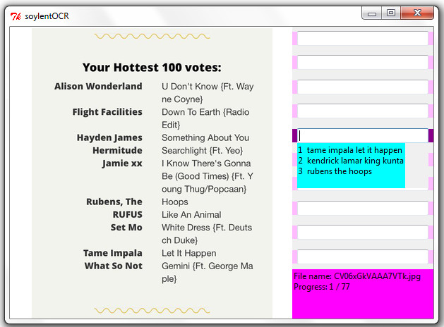
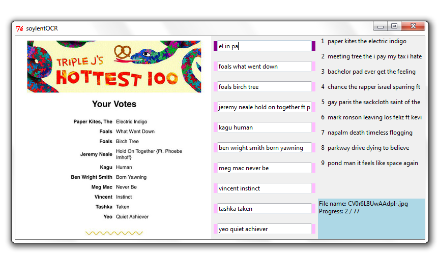

# soylentOCR
Computer Assisted Human Based Data Entry 

http://www.grant-trebbin.com/2016/03/improved-computer-assisted-human-based.html

I was interested in the cross over point, where for certain size tasks it's easier to enter data manually than train and test an OCR system.  My main aim was to see if I could assist the manual input method.  SoylentOCR is the result.

SoylentOCR allows you to move though a series of images with the tab and shift-tab keys.  The up and down keys allow you to move between entry boxes on the screen.  As you type, SoylentOCR will try to predict what is being entered and offer suggestios that match based on previous entries.  If you haven't entered anything, the most common entries are suggested.  A suggestion can be selected by pressing its number in combination with the control key, or if you want to select the first selection, just press enter.  This will fill the entry box will the suggestion and advance focus to the next entry box.  Entry boxes can be cleared with the shift-delete combination.

SoylentOCR processes all files in a directory that is hard coded into the software.  Resutls are recorded in an sqlite3 database that is also hard coded into the program.  If this database doesn't exist it will be created.  It may be advantageous in some situations to pre add fake data to the database via a databse editor to train it.  This means that when the program is started it will be able to offer suggestions as soon as data is entered.

http://www.grant-trebbin.com/2016/03/soylent-ocr-computer-assisted-human.html

The original version of the software had a more complicated 3 column interface.  Suggestions were presented in the third column, but this meant that your eyes were constantly darting around the screen wasting time.  You first had to read data in the first column, glance at the third column while typing to see the suggestion you were looking for, and occasionally look at the centre column to see what you were typing.

Another problem with this interface was that too many suggestions were presented.  THe idea was that you could type a few letters, see the one you wanted and then easily select it.  After testing it became apparent that this idea was floored.  It was hard for your eyes to scan the suggestion list to find the one you were after.  It was simply easier to keep typing until the required suggestion was near the top.

Due to the above problems, the second version of the intreface removed the suggesiton column and changed it into a suggesiton label that was placed under the current entry box.  The number of suggestions were also limited to 3.  On a set of test images, this reduced input time to 60% (v2) from 80% (v1) of the time it took to enter data unassisted.

Grant Trebbin 2016
